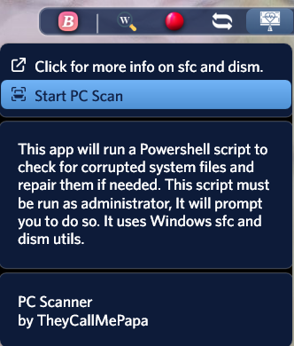

<h1 align="center">
   
  
   
  PC Scanner
   
</h1>

<h4 align="center">Keeps your PC healthy to help minimize Droptop/Rainmeter crashes.</h4>

  
  
  
  

  <a href="#key-features">Key Features</a> •
  <a href="#how-to-use">How To Use</a> •
  <a href="#download">Download</a> •
  <a href="#credits">Credits</a> •
  <a href="#license">License</a>

## Key Features
Keeps your PC healthy to help minimize Droptop/Rainmeter crashes.

## How to use
Install and activate the app.  Left click "Start PC Scan".

## Download
[Droptop Four Community Apps](https://droptopfour.com/community-apps/?id=26)

## Credits
Written by [TheyCallMePapa](https://github.com/papa-boynton)

## License
Creative Commons Attribution-Non-Commercial-Share Alike 3.0
